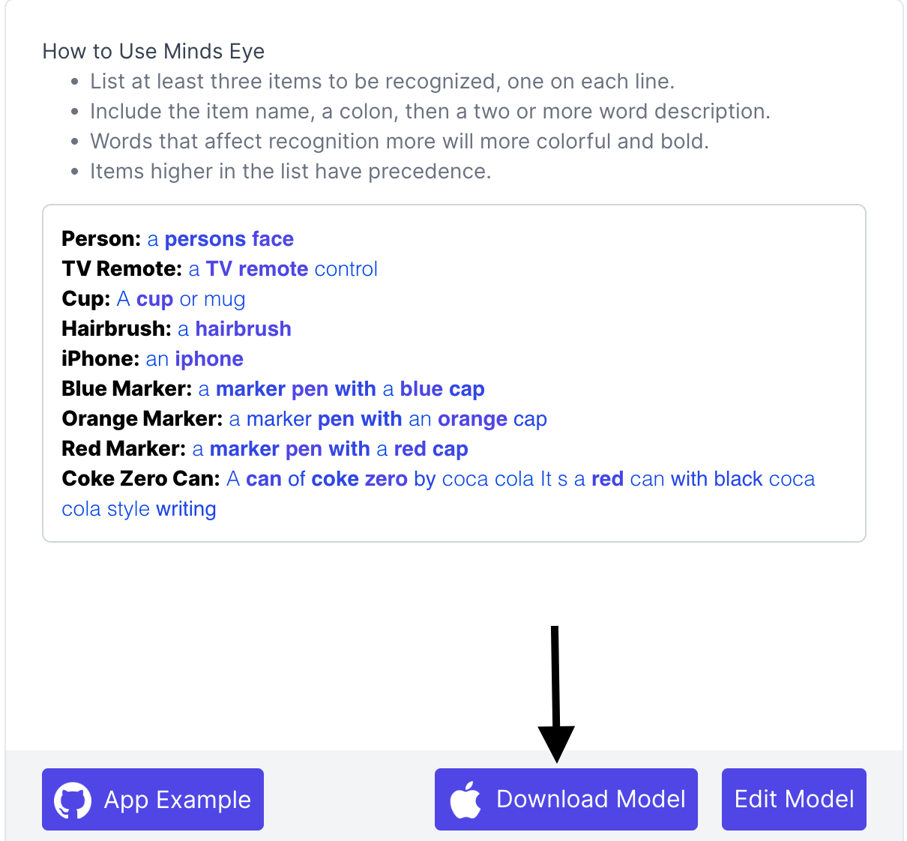

# Passio-MindsEye-Android-Distribution

## Getting Started

1. In order to use Passio's MindsEye app first go to [MindsEye](https://labs.passiolife.com/mindseye), type in what you want to recognize, and click "Download Model".


2. Clone this repo. Open the MindsEye Sandbox app in Android Studio.

3. Store the downloaded model to **MindsEyeSandbox/app/src/main/assets** folder. 

4. In the **MainActivity** find the line
```private const val MODE_FILENAME = "model.tflite"```
Change the *model.tflite* with the name of the model stored in the assets folder.

5. Run the app on your phone and recognize the items you listed in MindsEye
